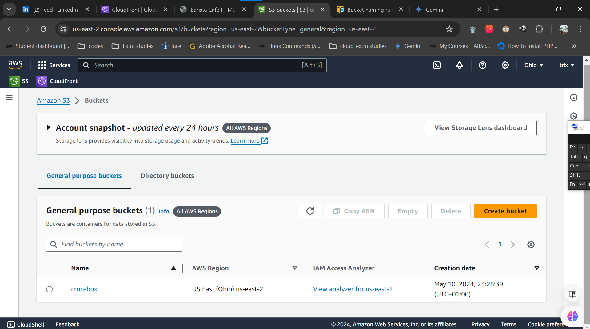

# Hosting a Static Webpage Using Amazon S3 Bucket and CloudFront

A static webpage offers a streamlined browsing experience by delivering pre-built content to users, making it an ideal choice for websites with unchanging information. By leveraging Amazon S3 Bucket and CloudFront services provided by AWS, you can efficiently host your static webpage with scalability, security, and performance in mind.

## Step-by-Step Guide:

### 1. Create an S3 Bucket:

1. **Log in to AWS Console**: Access the AWS Management Console using your credentials.
   
2. **Navigate to S3 Service**: Once logged in, locate and select the S3 service from the list of AWS services.
   
   
   
3. **Create a Bucket**: Click on the "Create bucket" button to initiate the bucket creation process.
   
4. **Bucket Configuration**:
   - **Unique Name**: Choose a globally unique name for your bucket, ensuring it hasn't been taken by another user.
   - **Region Selection**: Opt for a region close to your target audience to minimize latency. (Example: US East (Ohio) - us-east-2)
   
5. **Default Settings**: Maintain default settings for the remaining options unless specific configurations are required.
   
6. **Create Bucket**: Finalize the process by clicking the "Create bucket" button.

   

   

### 2. Upload Webpage Content to S3 Bucket:

1. **Access Bucket**: Navigate to your newly created S3 bucket from the AWS Management Console.
   
2. **Upload Files**: Upload your static webpage files (HTML, CSS, JavaScript, images, etc.) into the bucket using the "Upload" button or drag-and-drop functionality.
   
    
  
    

### 4. Set Up Amazon CloudFront Distribution:

1. **Access CloudFront Service**: Navigate to the AWS Management Console and select the CloudFront service.

2. **Create Distribution**:
   - Click on the "Create Distribution" button.
   
      
   
   - Origin Settings:
   - select Origin Access Control and click on create new oac 
   
     
   - Configure other settings as per your requirements or leave the default settings.
   
     

3. **Finalize and Create**:
   - Review your configuration and click on the "Create Distribution" button to create your CloudFront distribution.

   - Once created you get prompted to update your s3 bucket policy
   
     

   - Copy the bucket policy and navigate to your S3 bucket select permission and update the bucket policy at the required field and save changes.
   
     

### 5. Testing:

Access your static webpage using the provided CloudFront distribution URL or custom domain (if configured) to ensure successful hosting and content delivery.

   
   

By following these steps, you can seamlessly host your static webpage using Amazon S3 Bucket and CloudFront services, providing users with a fast, reliable, and scalable browsing experience.
